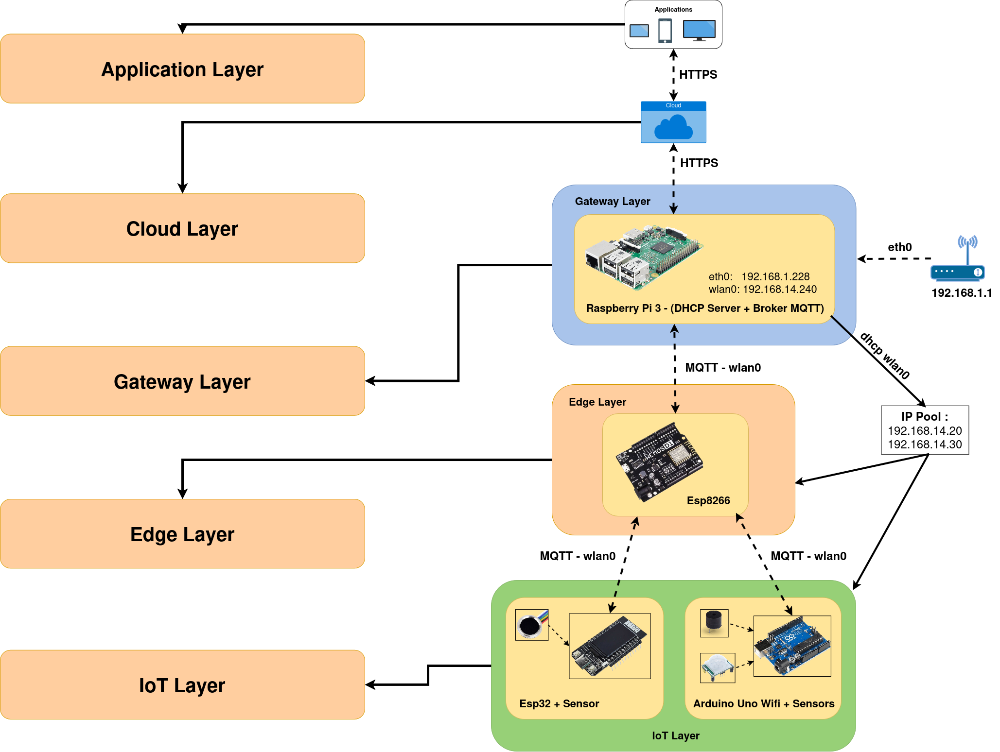

# Evaluation of a MCU-Deployed Siamese Neural Network-based IDS using a real IoT attack dataset
The proliferation of Internet of Things (IoT) devices has introduced significant cyber security challenges, necessitating robust and efficient Intrusion Detection Systems (IDSs) tailored for IoT-edge environments. In this context, on-board training is an emerging approach to support continuous learning in IoT-edge smart devices, useful for training the model with on-field data and reducing concept drift and data privacy violations. On the other hand, short and representative dataset should be provided to reduce energy consumption during on-board training of tiny IDSs deployed on resource-constrained IoT-edge devices. Moreover, appropriate network models trainable with reduced dataset should be used.  
<br>
Therefore, this project presents a performance assessment of a Siamese Neural Network (SNN)-based IDS deployed on tiny Microcontroller Unit (MCU). To evaluate the SNN’s ability to learn similarity metrics for detecting anomalous traffic patterns indicative of IoT-edge attacks, a realistic IoT dataset has been produced. Moreover, the Ton_IoT dataset widely leveraged in the literature has been used. The study evaluates the system detection accuracy, latency, and energy consumption, ensuring its practical applicability in IoT-edge environments. The findings demonstrate that the SNN-based IDS achieves a high detection rate, while operating within the computational and power constraints of MCU platforms, making it a promising solution for securing IoT-edge environments

## Table of Contents
- [Folder Structure](#folder-structure)
- [Datasets](#datasets)
- [Architecture](#architecture)
  - [Physical Devices](#physical-devices)
  - [Physical Sensors](#physical-sensors)
  - [Logical Schema](#logical-schema)
- [Setup Raspberry Pi 3 Model B](#setup-raspberry-pi-3-model-b)
  - [Create *watchdog_raspi.service*](#create-watchdog_raspiservice)
  - [Create Network](#create-network)
  - [Secure Configuration](#secure-configuration) 
- [Authors](#authors)

## Folder Structure
This repository contains the code and documentation for an dataset of cyber attacks on a IoT cloud-based thesis project:
- **[App](https://github.com/Alberto-00/Thesis-IoT_Cloud_based/tree/main/App)**: contains the server-side code and APIs used to manage IoT devices and data and the CLI for interacting with domotic door
- **[IoT_sketches](https://github.com/Alberto-00/Thesis-IoT_Cloud_based/tree/main/IoT_sketches)**: scripts to develop the different boards
- **[documents](https://github.com/Alberto-00/Thesis-IoT_Cloud_based/tree/main/documents)**: contains the datasheet of boards and sensors and the papers reviewed
- **[siamese_network](https://github.com/Alberto-00/Thesis-IoT_Cloud_based/tree/main/siamese_network)**: contains the Siamese network and classifier codes, as well as the dataset and results

## Datasets
The datasets used for the experiments can be found in the <a href="https://github.com/Alberto-00/Thesis-IoT_Cloud_based/tree/main/siamese_network/datasets">siamese_network/datasets</a> folder and include:
<ul>
  <li><b>Few_Shot-IoT</b>: the dataset created specifically for this work. </li>
  <li><b>TON_IoT</b>: the standard TON_IoT dataset, used for comparison and benchmarking.</li>
</ul>
Both datasets were balanced to ensure an equivalent number of samples for each class of attack, thus improving the reliability and fairness of the results. To access the complete, pre-processed datasets, click <a href="https://drive.google.com/drive/folders/1eudKghSMOHXe3gJIG3n5iYRCLLYA9REq?usp=sharing">here</a>.

## Architecture
The IoT Cloud-based architecture we are going to consider represents the configuration of a domotic door that allows access into the home via a fingerprint reader and proximity sensor: it detects the presence of strangers. 

### Physical Devices
The devices involved in the architecture are as follows and their datasheet are placed **[here](https://github.com/Alberto-00/Thesis-IoT_Cloud_based/tree/main/documents/datasheet/boards)**:

<div align="center">
  
| WeMos D1 ESP8266 WiFi Board | TTGO LoRa32-OLED       |
|-----------------------------|------------------------|
| <p align="center"></p>            | <p align="center"></p>       |
| Arduino Uno WiFi Rev2       | Raspberry Pi 3 Model B |
| <p align="center"></p>          | <p align="center"></p> |

</div>
<br>

### Physical Sensors
The sensors involved in the architecture are as follows and their datasheet are placed **[here](https://github.com/Alberto-00/Thesis-IoT_Cloud_based/tree/main/documents/datasheet/sensors)**:

<div align="center">
  
|               | Arduino Uno WiFi  |  ESP32 |
|---------------|-------------------|-------------------|
| **Buzzer 3 Pins**     | <p align="center"></p> | |
| **HC-SR501 Pir Motion Detector**   | <p align="center"></p>| |
| **Adafruit Fingerprint Sensor** | | <p align="center"></p> |

</div>
<br>

### Logical Schema
The logic of the architecture is divided into several levels:

- **IoT Layer**: *ESP32* with fingerprint sensor and *Arduino Uno WiFi Rev2* with proximity sensors and buzzer;

- **Edge Layer**: *ESP8266* receives the information sent by *ESP32* and *Arduino* via *MQTT protocol*, filters it and sends it to the *Raspberry Pi*;

- **Gateway Layer**: the *Raspberry Pi* is networked via a wired connection to the modem, while, via the WLAN, it performs the functions of DHCP server (to provide IP addresses to the boards) and MQTT broker. The WLAN interface is configured so that the *Raspberry Pi* acts as an access point to allow communication between all the boards. Configuration of the WLAN network was done by setting a static IP to the *Raspberry Pi* on a network other than the Ethernet network, thus ensuring a separation between the two networks and optimizing network traffic management. The *Raspberry Pi* also collects the information transmitted from the *ESP8266*, updates a CSV file on Google Drive and sends data from an app client to *ESP8266*.

<br>
<p align="center">
  
</p>

## Setup Raspberry Pi 3 Model B
The Raspberry Pi acts as both Access Point and MQTT broker. The Access Point was configured via **hostapd** allowing the boards to connect and communicate with each other. The boards do not communicate with the outside world, so no IP forwarding is used, but only communicate with the Raspberry Pi and with each other. IP addresses are provided by the Raspberry Pi, which acts as a DHCP server via **dnsmasq**. First, a static IP was assigned to the Raspberry Pi with **dhcpcd**, then the pool of addresses to be assigned to each device was set up (randomly). Next, the **Mosquitto broker** was installed on the Raspberry Pi.

---
> ### ❗❗❗ ATTENTION - Raspberry Pi OS ❗❗❗
> For this configuration, the Raspberry Pi must have <b>Debian version Bullseye</b> as OS in order to use <b>dhcpcd</b> as the network interface. In fact, in later versions dhcpcd is replaced with the <b>Network Manager</b>. 
> To install OS for Raspberry Pi follow this <a href="https://www.raspberrypi.com/documentation/computers/getting-started.html#installing-the-operating-system">guide</a>.
---
> ### ❗❗❗ ATTENTION - Wired Connection ❗❗❗
> If you want to connect the Rasberry Pi via Ethernet to the PC instead of the modem, follow these steps on your PC with Ubuntu OS:
> 1. plug the Ethernet cable into your network card
> 2. go to `Settings - Network` 
> 3. in the ethernet connection settings go to `identity`:
> - set the `Name` to `bridge`
> - set the `MAC Address` to `eno2`
> 5. in the `IPv4` section set the flag to `Shared with other computers`
---

If ssh access does not work, try unplugging and re-plugging the ethernet cable. SSH Raspberry credentials:
- **username**:  `alberto`
- **password**: `alberto`

Once logged in, the first thing to do is to update the system:
```
sudo apt update
```
```
sudo apt upgrade -y
```

### Create *watchdog_raspi.service*
The **watchdog_raspi** application allows the Raspberry Pi device to check for updates to the CSV file on Google Drive. The CSV file is a log file where all actions chosen by the user or performed by the device are stored. In fact, when devices exchange information, this is retrieved from the Raspberry Pi and via the application saved to Google Drive. So, if a user, via the client application, performs an operation, it is saved on the CSV, retrieved from the Raspberry Pi and sent to the boards to execute commands.

In order for the python application to be launched automatically each time the system is booted, we create a new service by following these steps:

``` 
sudo nano /etc/systemd/system/watchdog_raspi.service
```

Inside the new file paste this script:

``` 
[Unit]
Description=Script Python che permette di collegarsi a Google Drive e filtrare il traffico tra le schede
After=network.target

[Service]
ExecStart=python /home/alberto/watchdog_raspi/cloud-raspy.py
WorkingDirectory=/home/alberto/watchdog_raspi/
StandardOutput=inherit
StandardError=inherit
Restart=always
RestartSec=5

[Install]
WantedBy=multi-user.target
``` 
Finally, we enable the new service:

``` 
sudo systemctl daemon-reload
```

``` 
sudo systemctl enable watchdog_raspi.service
```

``` 
sudo systemctl start watchdog_raspi.service
```

### Create Network
The reference guide used is as follows: **[LINK](https://pimylifeup.com/raspberry-pi-wireless-access-point/)**

**Initial Setup**
```
sudo apt install -y hostapd dnsmasq iptables

sudo systemctl unmask hostapd
sudo systemctl enable hostapd
```
Set the WLAN language to `IT` with `sudo raspi-config nonint do_wifi_country IT` or following these steps:
- `sudo raspi-config` 
  - `Localisation Options` 
  - `L4 WLAN Country` 
  - `IT` 

<br>

**Static IP** <br>
Next, we type `sudo nano /etc/dhcpcd.conf` and within this file we must add the following lines (with the respective spaces) to the end of the file to create the static ip of the Raspberry Pi:
```
interface wlan0
    static ip_address=192.168.14.240/24
    nohook wpa_supplicant
```

<br>

**Setup *dnsmasq***<br>
Now you configure **dnsmasq** to assign the address pool to the clients that will connect to the Raspberry PI:
```
sudo nano /etc/dnsmasq.conf
```
Add these lines to the end of the file:
```
interface=wlan0
dhcp-range=192.168.14.20,192.168.14.30,255.255.255.0,24h
```
We give a higher range so that there are no problems; the lease is set for 24 hours after which the device is assigned a new IP. To delete the leases and reset everything we do:
```
sudo systemctl stop dnsmasq
sudo rm /var/lib/misc/dnsmasq.leases
sudo systemctl start dnsmasq
sudo systemctl restart hostapd
```

<br>

**Access Point**<br>
Let's set up the access point configuration:
```
sudo nano /etc/hostapd/hostapd.conf
```
In the `hostapd.conf` file write this:
```
country_code=IT
interface=wlan0
driver=nl80211

hw_mode=g
ieee80211n=1
channel=7
wmm_enabled=0
macaddr_acl=0
ignore_broadcast_ssid=0

auth_algs=1
wpa=2
wpa_key_mgmt=WPA-PSK
wpa_pairwise=TKIP
rsn_pairwise=CCMP

# This is the name of the network
ssid=Rasberry-AP

# The network passphrase
wpa_passphrase=Password123
```
In the end:
```
sudo nano /etc/default/hostapd
```
```
DAEMON CONF=”/etc/hostapd/hostapd.conf”
```
Before continuing, do `sudo reboot`. Also, to see if the Raspberry Pi's WLAN IP has changed and all the setup went well, analyse the routing tables with the `route` command; if all went well we will see the different networks:
- `198.168.1.0`
- `198.168.14.0`

<br>

**Broker Mosquitto**<br>
Now install the Mosquitto broker:
```
sudo apt install mosquitto mosquitto-clients -y
```
And change the configuration file:
```
sudo nano /etc/mosquitto/conf.d/mosquitto.conf
```
```
listener 1883
protocol mqtt
allow_anonymous true

# log settings
log_type error
log_type warning
log_type notice
log_type information
```

### Secure Configuration
**Access Point**<br>
If you would like to have a secure configuration of the network you created add follow these steps:
```
sudo nano /etc/hostapd/hostapd.conf
```
```
country_code=IT
interface=wlan0
driver=nl80211

hw_mode=g
ieee80211n=1
channel=7
wmm_enabled=0
max_num_sta=3
macaddr_acl=1
accept_mac_file=/etc/hostapd/hostapd.accept
ignore_broadcast_ssid=0

auth_algs=1
wpa=2
wpa_key_mgmt=WPA-PSK
wpa_pairwise=TKIP
rsn_pairwise=CCMP

ssid=Rasberry-AP
wpa_passphrase=%3LaB6_!oT4%
```
Set the MAC address white list:
```
sudo nano /etc/hostapd/hostapd.accept
```
```
# Esp8266 
DC:4F:22:60:82:BF

# Esp32
78:21:84:89:02:E4

# Arduino
34:94:54:23:13:58
```

<br>

**Broker Mosquitto**<br>
Now let's set up the **TLS 1.2** protocol in Mosquitto broker:
```
sudo nano /etc/mosquitto/conf.d/mosquitto.conf
```
```
user root
listener 1883
protocol mqtt
cafile /etc/mosquitto/certs/ca.crt
certfile /etc/mosquitto/certs/broker.crt
keyfile /etc/mosquitto/certs/broker.key
require_certificate true
allow_anonymous false
password_file /etc/mosquitto/passwd
tls_version tlsv1.2
acl_file /etc/mosquitto/aclfile

# log settings
log_type error
log_type warning
log_type notice
log_type information
```

<br>

Sets passwords for authenticating client devices:
```
sudo mosquitto passwd -c /etc/mosquitto/passwd esp8266
```
- **Password: `%Esp_82!!%`**

```
sudo mosquitto passwd -c /etc/mosquitto/passwd esp32
```
- **Password: `%Esp_32%AlB`**

```
sudo mosquitto passwd -c /etc/mosquitto/passwd arduino
```
- **Password: `%A3duino_W!F%`**

```
sudo mosquitto passwd -c /etc/mosquitto/passwd broker
```
- **Password: `%BR0k3_I!t%`**

<br>

Sets acl file post and subscribe only to certain topics:
```
sudo nano /etc/mosquitto/aclfile
```
```
user broker
topic readwrite rasberry/topic

user esp8266
topic write rasberry/topic
topic write esp32/topic
topic write arduino/topic
topic read esp8266/topic

user esp32
topic write esp8266/topic
topic read esp32/topoc

user arduino
topic write esp8266/topic
topic read arduino/topic
```

<br>

To create the certificates, this guide was taken as a reference: **[LINK](https://openest.io/en/services/mqtts-how-to-use-mqtt-with-tls/)**
```
sudo mkdir -p /etc/mosquitto/certs
```

<br>

> **❗❗❗ ATTENTION - CN Name ❗❗❗** <br>
> CN Name of CA must be different from the others:
> - CN Name of CA is <b>unisa.com</b>
> - CN Name of other certificates is <b>client</b>.

<br>

**[CERTIFICATE CA]** <br>
```
sudo openssl req -new -x509 -days 3650 -extensions v3 ca -keyout /etc/mosquitto/certs/ca.key -out /etc/mosquitto/certs/ca.crt
```
- **PEM pass phrase: `%M0ss_aL3!2%`**

<br>

**[CERTIFICATE BROKER]** <br>
```
sudo openssl genrsa -out /etc/mosquitto/certs/broker.key 2048
```
```
sudo openssl req -out /etc/mosquitto/certs/broker.csr -key /etc/mosquitto/certs/broker.key -new
```
```
sudo openssl x509 -req -in /etc/mosquitto/certs/broker.csr -CA /etc/mosquitto/certs/ca.crt -CAkey /etc/mosquitto/certs/ca.key -CAcreateserial -out /etc/mosquitto/certs/broker.crt -days 3650
```
```
sudo rm -rf /etc/mosquitto/certs/broker.csr
```

<br>

**[CERTIFICATE ESP8266]** <br>
```
sudo openssl genrsa -out /etc/mosquitto/certs/esp8266.key 2048
```
```
sudo openssl req -out /etc/mosquitto/certs/esp8266.csr -key /etc/mosquitto/certs/esp8266.key -new
```
```
sudo openssl x509 -req -in /etc/mosquitto/certs/esp8266.csr -CA /etc/mosquitto/certs/ca.crt -CAkey /etc/mosquitto/certs/ca.key -CAcreateserial -out /etc/mosquitto/certs/esp8266.crt -days 3650
```

<br>

**[CERTIFICATE ESP32]** <br>
```
sudo openssl genrsa -out /etc/mosquitto/certs/esp32.key 2048
```
```
sudo openssl req -out /etc/mosquitto/certs/esp32.csr -key /etc/mosquitto/certs/esp32.key -new
```
```
sudo openssl x509 -req -in /etc/mosquitto/certs/esp32.csr -CA /etc/mosquitto/certs/ca.crt -CAkey /etc/mosquitto/certs/ca.key -CAcreateserial -out /etc/mosquitto/certs/esp32.crt -days 3650
```

<br>

**[CERTIFICATE ESP32]** <br>
```
sudo openssl genrsa -out /etc/mosquitto/certs/arduino.key 2048
```
```
sudo openssl req -out /etc/mosquitto/certs/arduino.csr -key /etc/mosquitto/certs/arduino.key -new
```
```
sudo openssl x509 -req -in /etc/mosquitto/certs/arduino.csr -CA /etc/mosquitto/certs/ca.crt -CAkey /etc/mosquitto/certs/ca.key -CAcreateserial -out /etc/mosquitto/certs/arduino.crt -days 3650
```

<br>

**Setup NTP Server**<br>
To synchronise the clocks on the boards and on the Raspberry Pi we use the **NTP sever**. This is used to validate certificates during handshake TLS:
```
sudo apt install ntp
sudo nano /etc/ntp.conf
```
Add the row:
```
restrict 192.168.14.240 mask 255.255.255.0 nomodify notrap
```

```
sudo systemctl disable ntp
sudo systemctl restart ntp
```

<br>

You create a script that is started at Raspberry Pi boot to synchronise its clock:
```
sudo nano /etc/init.d/ntp-sync.sh
```
```
#!/bin/sh

sudo ntpd -gq
sudo systemctl start ntp
```
```
sudo chmod +x /etc/init.d/ntp-sync.sh
sudo nano /etc/rc.local
```
```
sh /etc/init.d/ntp-sync.sh
```

<br>

To see the updated time, enter this command:
```
timedatectl status
```

## Authors
| Name | Description |
| --- | --- |
| <p dir="auto"><strong>Alberto Montefusco</strong> |<br>Developer - <a href="https://github.com/Alberto-00">Alberto-00</a></p><p dir="auto">Email - <a href="mailto:a.montefusco28@studenti.unisa.it">a.montefusco28@studenti.unisa.it</a></p><p dir="auto">LinkedIn - <a href="https://www.linkedin.com/in/alberto-montefusco">Alberto Montefusco</a></p><p dir="auto">My WebSite - <a href="https://alberto-00.github.io/">alberto-00.github.io</a></p><br>|
